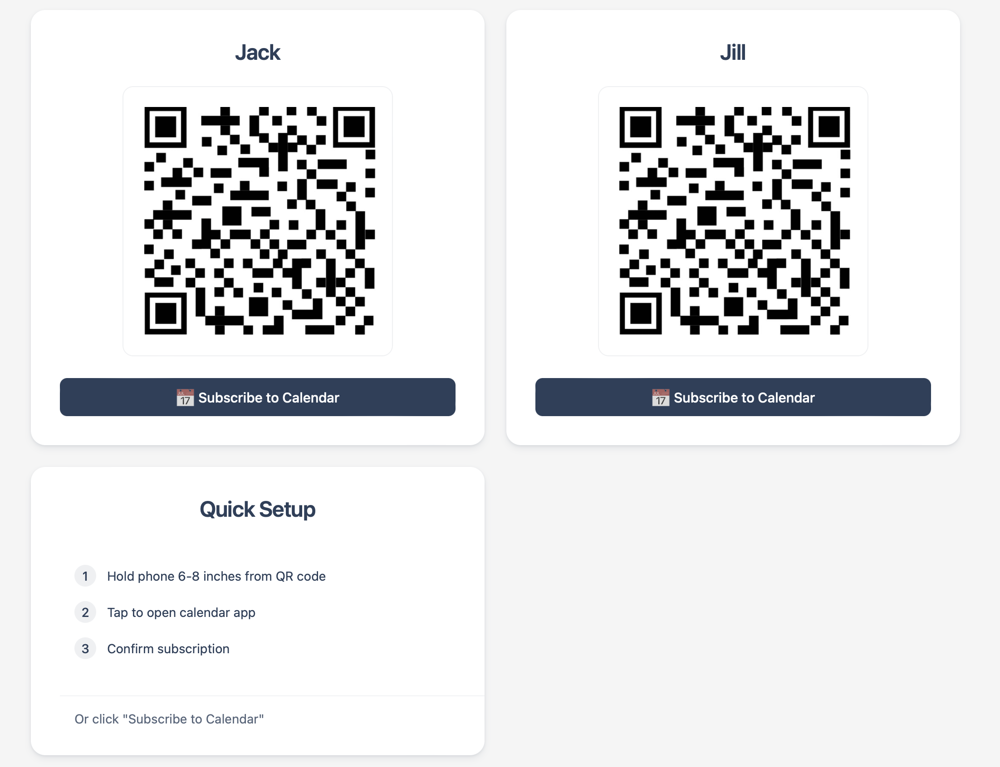

# Blackbaud Calendar QR Generator

A modern, responsive web component for Blackbaud that generates QR codes for easy student calendar subscriptions. Built with vanilla JavaScript, it provides a seamless experience across all device sizes, automatically adapting its interface between desktop and mobile views.

## Key Features
- Dual-mode interface that automatically switches based on device type:
  - Desktop: QR codes with step-by-step scanning instructions
  - Mobile: Direct subscription buttons
- Responsive grid layout with maximum 2-column configuration
- Infinite width scaling support for extreme browser sizes
- Smart loading of QR code library (desktop only)
- Maintains visual hierarchy with centered titles and consistent button styling
- Intelligent layout adaptation between desktop and mobile views

## Desktop View

- Two-column grid layout for student calendar cards
- QR codes displayed prominently for easy scanning
- Quick Setup card provides clear scanning instructions
- Subscribe buttons available as alternative to QR scanning

## Mobile View

- Single-column layout optimized for mobile screens
- QR codes hidden to simplify mobile interface
- Full-width subscription buttons
- Streamlined Quick Setup instructions
- No minimum width constraints for maximum compatibility

## Tech Stack
- Pure HTML, CSS, and JavaScript
- QRCode.js (loaded conditionally for desktop only)
- CSS Grid and Flexbox for responsive layouts
- CSS Custom Properties for theming
- Blackbaud API integration

## Design Features
- Two-column maximum grid layout for optimal readability
- Consistent card styling with subtle hover effects
- Centered titles with left-aligned content where appropriate
- Fully fluid layouts with no minimum width constraints
- Proper spacing and padding across all screen sizes
- High-contrast color scheme for accessibility
- Clear visual hierarchy and content organization

## Mobile Optimizations
- Automatic interface adaptation based on screen size
- Removal of QR codes on mobile for streamlined experience
- Full-width touch targets for better interaction
- Optimized spacing and typography for small screens
- Efficient asset loading (no QR library on mobile)
- Flexible width support for all device sizes

## Smart Features
- Automatic device type detection
- Conditional loading of QR code library
- Dynamic webcal:// URL generation with timestamps
- Error handling for failed data fetches
- Debounced resize handling for performance

## Integration Notes
- Designed to be embedded within Blackbaud's tile system
- Fetches calendar data from Blackbaud's API
- Maintains consistent styling with Blackbaud's design system
- Supports multiple student calendars per view
- Handles various calendar data structures

## Browser Support
- Modern evergreen browsers (Chrome, Firefox, Safari, Edge)
- Full mobile browser support
- Graceful fallbacks for older browsers
- Responsive down to smallest mobile screens
- No minimum width restrictions

The QR Generator provides a seamless experience for subscribing to student calendars, whether using QR codes on desktop or direct subscription on mobile devices. Its adaptive design ensures optimal usability across all platforms while maintaining visual consistency with Blackbaud's interface.